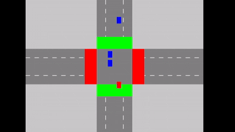

# Traffic Queue Simulator

A real-time traffic intersection simulation that demonstrates queue data structures and traffic management algorithms. The simulation includes different types of vehicles, traffic lights, and dynamic queue management.



## Features

- Real-time traffic simulation at a 4-way intersection
- Multiple vehicle types (regular cars, ambulances, police cars, fire trucks)
- Dynamic traffic light system with priority management
- Queue-based traffic management
- Priority handling for emergency vehicles
- Special conditions for regular vehicles to skip red lights in certain situations
- Vehicle turning mechanics (left, right, straight)
- Visual representation of traffic flow
- Congestion detection and management

## Prerequisites

To run this simulation, you need:

- GCC or G++ compiler
- SDL2 library
- MinGW (for Windows)

### Installing SDL2

#### On Windows:
1. Download SDL2 development libraries from [SDL's website](https://www.libsdl.org/download-2.0.php)
2. Extract the contents to your project directory
3. Create these folders in your project if they don't exist:
   - `include` (for SDL2 header files)
   - `lib` (for SDL2 library files)
   - `bin` (for executable output)

## Project Structure

```
Traffic-Simulation/
├── include/          # Header files
├── lib/             # Library files
├── src/             # Source files
│   ├── main.c             # Main entry point
│   ├── traffic_simulation.h    # Header definitions
│   ├── traffic_simulation.c    # Implementation
│   └── generator.c       # Vehicle generator
├── bin/             # Executable output
└── README.md
```

## Building the Project

1. Clone the repository:
```bash
git clone https://github.com/yourusername/Traffic-Simulation.git
cd Traffic-Simulation
```

2. Compile both programs:

For the main simulation:
```bash
g++ -Iinclude -Llib -o bin/main.exe src/main.c src/traffic_simulation.c -lmingw32 -lSDL2main -lSDL2
```

For the vehicle generator:
```bash
g++ -o bin/generator src/generator.c src/traffic_simulation.c  -Iinclude -Llib -lmingw32 -lSDL2main -lSDL2
```

## Running the Simulation

1. First, start the vehicle generator:
```bash
./bin/generator.exe
```

2. In a separate terminal, start the main simulation:
```bash
./bin/main.exe
```

3. Watch as vehicles spawn and navigate through the intersection
4. Use the close button (X) to exit the simulation

## How It Works

### Program Components

The simulation consists of two separate programs:

1. **Generator (generator.exe)**: 
   - Generates vehicles with random properties
   - Writes vehicle data to a file for the main program to read
   - Spawns new vehicles every 500 milliseconds

2. **Main Simulation (main.exe)**:
   - Reads vehicle data from the generator
   - Renders the intersection and vehicles
   - Manages traffic flow and vehicle movement
   - Handles traffic light cycles

### Vehicle Types
- Blue: Regular cars
- Red: Ambulances
- Dark Blue: Police cars
- Orange-Red: Fire trucks

### Traffic Management
The simulation implements several key traffic management features:

1. **Queue System**: Each lane maintains a queue of vehicles waiting to pass through the intersection.
2. **Priority Handling**: Emergency vehicles (ambulances, police cars, fire trucks) get priority over regular vehicles.
3. **Traffic Light Cycles**: Traffic lights automatically cycle between red and green states.
4. **Turn Management**: Vehicles can turn left, right, or go straight through the intersection.
5. **Red Light Skipping**:
   - Emergency vehicles can always skip red lights
   - Right-turning vehicles can skip red lights in most situations
   - Regular vehicles can skip red lights under certain conditions (excessive wait time)

### Code Structure

- `main.c`: Program entry point and main simulation loop
- `traffic_simulation.h`: Header file containing structs and function declarations
- `traffic_simulation.c`: Implementation of traffic simulation logic
- `generator.c`: Vehicle generation logic

## Implementation Details

### Queue Data Structure
```c
typedef struct Node {
    Vehicle vehicle;
    struct Node* next;
} Node;

typedef struct {
    Node* front;
    Node* rear;
    int size;
} Queue;
```

### Vehicle States
```c
typedef enum {
    STATE_MOVING,
    STATE_STOPPING,
    STATE_STOPPED,
    STATE_TURNING
} VehicleState;
```

### Special Traffic Rules

The simulation implements realistic traffic rules including:

1. **Emergency Vehicle Priority**: Ambulances, police cars, and fire trucks automatically trigger green lights and can bypass red lights.
2. **Right Turn on Red**: Vehicles turning right can generally proceed even when the light is red (as in many real-world jurisdictions).
3. **Congestion Management**: If a lane becomes congested (more than 5 vehicles), the system prioritizes that lane.
4. **Wait Time Management**: Regular vehicles that have been waiting too long at a red light may eventually proceed (simulating real-world driver behavior).

## Controls

- The simulation runs automatically without user input
- Close the window to exit the program


## Contributing

1. Fork the repository
2. Create your feature branch (`git checkout -b feature/AmazingFeature`)
3. Commit your changes (`git commit -m 'Add some AmazingFeature'`)
4. Push to the branch (`git push origin feature/AmazingFeature`)
5. Open a Pull Request

## References

1. SDL2 Documentation: [https://wiki.libsdl.org/](https://wiki.libsdl.org/)
2. Queue Data Structure: Introduction to Algorithms, CLRS (Cormen, Leiserson, Rivest, Stein)
3. Traffic Flow Theory: Highway Capacity Manual (Transportation Research Board)
4. Intersection Management Algorithms: [IEEE Intelligent Transportation Systems](https://www.computer.org/csdl/proceedings-article/ic3/2017/08284361/12OmNx0RIRe)

## Technical Documentation

For detailed technical documentation about the implementation:

1. **Vehicle Generation**: Vehicles are spawned at regular intervals with randomized properties.
2. **Traffic Light System**: Uses a timer-based system with priority adjustments based on queue lengths and emergency vehicles.
3. **Collision Avoidance**: Vehicles maintain safe distances and respond to traffic signals and other vehicles.
4. **Queue Management**: Each lane maintains its own queue, with priority handling for emergency vehicles.
5. **Red Light Skipping Logic**: The `canVehicleSkipLight()` function determines when a non-emergency vehicle can proceed through a red light based on:
   - Wait time at the intersection
   - Type of turn being made
   - Presence of other vehicles

## Acknowledgments

- SDL2 development team
- Traffic simulation research community